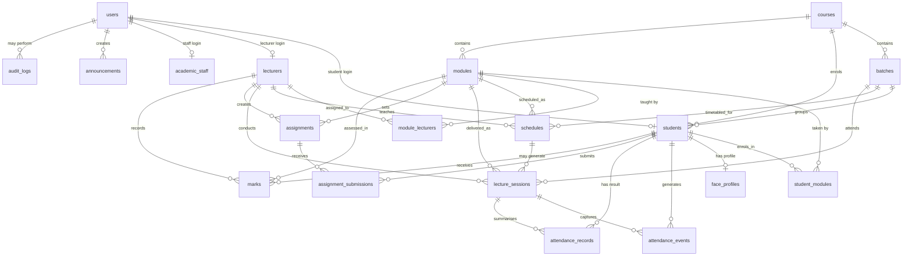

# Database Design

Database name: `smart_student_management`  
Engine: InnoDB  
Character set: `utf8mb4` / `utf8mb4_unicode_ci`  
Target: MySQL / MariaDB supplied with XAMPP

This schema is the shared data architecture for:

1. The PHP web application
2. The future Python face-recognition attendance service

The two applications remain logically separate. They will later read and write this same MySQL database (directly and/or through a Flask REST API). Face image binaries and encoding files are **not** stored in MySQL.

Schema file: `database/schema/schema.sql`

## Design rules

- Surrogate integer primary keys (`INT UNSIGNED AUTO_INCREMENT`)
- Foreign keys on all relationships
- Unique constraints where a business rule forbids duplicates
- `created_at` / `updated_at` on maintained entities
- `password_hash` only; never plain-text passwords
- `DECIMAL` for marks, credits, and recognition confidence
- `ON DELETE RESTRICT` for academic, identity, and attendance history
- `ON DELETE SET NULL` only where the child row must survive without the parent
- No sample users, students, or password hashes are inserted

## Delete behaviour

Most parent rows cannot be deleted while dependent academic or attendance history exists. Operational records should be deactivated with `status`, not removed.

| Parent | Child | ON DELETE | Reason |
|---|---|---|---|
| `users` | `students`, `lecturers`, `academic_staff`, `announcements` | RESTRICT | Keep identities and authored content |
| `users` | `audit_logs` | SET NULL | Logs must remain after account removal |
| `courses` / `batches` / `modules` / `students` / `lecturers` | Enrolment, timetable, sessions, marks, attendance | RESTRICT | Preserve academic history |
| `schedules` | `lecture_sessions.schedule_id` | SET NULL | A held session still happened if the timetable slot is later removed |
| `lecture_sessions` | `attendance_events`, `attendance_records` | RESTRICT | Never discard attendance evidence |

`ON UPDATE CASCADE` is used because primary keys are surrogate IDs. IDs are not expected to change.

## Table purposes

### 1. `users`

Login identity for Admin, Academic Staff, Lecturer, and Student.

- **Primary key:** `user_id`
- **Unique:** `username`, `email`
- **Notes:** `role` is the authorisation source. `password_hash` stores a one-way hash only (for example bcrypt or Argon2). Admin users exist only in this table.

### 2. `courses`

Academic programmes such as a degree or diploma.

- **Primary key:** `course_id`
- **Unique:** `course_code`

### 3. `batches`

A student intake attached to one course.

- **Primary key:** `batch_id`
- **Foreign keys:** `course_id` → `courses.course_id`
- **Unique:** `(course_id, batch_name)` so the same batch name is not reused inside one course
- **Also unique:** `(batch_id, course_id)` so `students` can reference both columns together

### 4. `students`

Student profile and enrolment details.

- **Primary key:** `student_id`
- **Foreign keys:**
  - `user_id` → `users.user_id` (one login per student)
  - `course_id` → `courses.course_id`
  - `batch_id` → `batches.batch_id`
  - `(batch_id, course_id)` → `batches(batch_id, course_id)` so a student cannot be placed in a batch from another course
- **Unique:** `user_id`, `registration_no`
- **Notes:** `profile_photo` is a file path under `web/uploads/`, not binary image data.

### 5. `lecturers`

Lecturer profile.

- **Primary key:** `lecturer_id`
- **Foreign keys:** `user_id` → `users.user_id`
- **Unique:** `user_id`, `staff_no`

### 6. `academic_staff`

Academic staff profile.

- **Primary key:** `academic_staff_id`
- **Foreign keys:** `user_id` → `users.user_id`
- **Unique:** `user_id`, `staff_no`

Application code should keep `users.role` consistent with the matching profile table. A user should not have more than one role profile.

### 7. `modules`

A teachable subject belonging to a course.

- **Primary key:** `module_id`
- **Foreign keys:** `course_id` → `courses.course_id`
- **Unique:** `(course_id, module_code)`
- **Notes:** `credits` is `DECIMAL(4,1)` to allow values such as `1.5`.

### 8. `student_modules`

Which students are enrolled on which modules.

- **Primary key:** `student_module_id`
- **Foreign keys:** `student_id` → `students.student_id`, `module_id` → `modules.module_id`
- **Unique:** `(student_id, module_id)` — prevents duplicate enrolment

### 9. `module_lecturers`

Which lecturers are assigned to which modules.

- **Primary key:** `module_lecturer_id`
- **Foreign keys:** `module_id` → `modules.module_id`, `lecturer_id` → `lecturers.lecturer_id`
- **Unique:** `(module_id, lecturer_id)` — prevents duplicate assignment

### 10. `schedules`

Recurring weekly timetable slots. This is the plan, not a single class that already happened.

- **Primary key:** `schedule_id`
- **Foreign keys:** `module_id` → `modules.module_id`, `lecturer_id` → `lecturers.lecturer_id`, `batch_id` → `batches.batch_id`
- **Check:** `end_time > start_time`

### 11. `lecture_sessions`

One real lecture on one date. Attendance is always attached to a session, never only to a timetable row.

- **Primary key:** `session_id`
- **Foreign keys:**
  - `module_id` → `modules.module_id`
  - `lecturer_id` → `lecturers.lecturer_id`
  - `batch_id` → `batches.batch_id`
  - `schedule_id` → `schedules.schedule_id` (nullable)
- **Unique:** `(module_id, batch_id, session_date, scheduled_start)`
- **Notes:** `late_after_minutes` is the grace period used later by attendance processing. `actual_start` / `actual_end` record when the session really ran.

### 12. `face_profiles`

Metadata for a student's enrolled face model.

- **Primary key:** `face_profile_id`
- **Foreign keys:** `student_id` → `students.student_id`
- **Unique:** `student_id` — at most one face profile row per student in this initial design
- **Notes:** `encoding_path` points to a file under `face-recognition/encodings/`. Sample images belong under `face-recognition/dataset/`. MySQL does not store encodings, images, or `.pkl` blobs.

### 13. `attendance_events`

Raw valid door/camera events produced by recognition.

- **Primary key:** `event_id`
- **Foreign keys:** `student_id` → `students.student_id`, `session_id` → `lecture_sessions.session_id`
- **Indexes:**
  - `(session_id, student_id, recognized_at)`
  - `(student_id, recognized_at)`
  - `(session_id, event_type, recognized_at)`
- **Notes:** `event_type` is `IN` or `OUT`. `confidence` is `DECIMAL(5,2)` in the range 0.00–100.00. A recognition is not treated as `PRESENT` by itself.

### 14. `attendance_records`

Processed attendance decision for one student in one session.

- **Primary key:** `attendance_id`
- **Foreign keys:** `student_id` → `students.student_id`, `session_id` → `lecture_sessions.session_id`
- **Unique:** `(student_id, session_id)` — one final record per student per session
- **Status:** `PRESENT`, `LATE`, or `ABSENT`
- **Notes:** `left_early` is a boolean (`TINYINT(1)`), not a status value, because a student can be late and also leave early.

### 15. `assignments`

Coursework set by a lecturer on a module.

- **Primary key:** `assignment_id`
- **Foreign keys:** `module_id` → `modules.module_id`, `lecturer_id` → `lecturers.lecturer_id`
- **Notes:** `file_path` is an optional uploaded brief. `max_marks` is `DECIMAL(8,2)`.

### 16. `assignment_submissions`

Student work against an assignment.

- **Primary key:** `submission_id`
- **Foreign keys:** `assignment_id` → `assignments.assignment_id`, `student_id` → `students.student_id`
- **Unique:** `(assignment_id, student_id)` — one submission row per student per assignment
- **Notes:** A later resubmission should update this row. `grade` is nullable until marked.

### 17. `marks`

Recorded assessment results for a student on a module.

- **Primary key:** `mark_id`
- **Foreign keys:**
  - `student_id` → `students.student_id`
  - `module_id` → `modules.module_id`
  - `recorded_by` → `lecturers.lecturer_id`
- **Check:** `0 <= marks_obtained <= max_marks` and `max_marks > 0`
- **Notes:** `assessment_type` is a string (assignment, quiz, exam, and similar) so new types can be added without a schema change.

### 18. `announcements`

Notices visible to one role or to all users.

- **Primary key:** `announcement_id`
- **Foreign keys:** `created_by` → `users.user_id`
- **Notes:** `target_role` includes `ALL`. `expires_at` is optional.

### 19. `audit_logs`

Activity history for security and traceability.

- **Primary key:** `log_id`
- **Foreign keys:** `user_id` → `users.user_id` (nullable, `ON DELETE SET NULL`)
- **Indexes:** `(user_id, created_at)`, `(entity_type, entity_id)`, `created_at`
- **Notes:** These rows are insert-oriented. They should not be updated as part of normal application flow.

## Important unique constraints

| Table | Constraint | Rule |
|---|---|---|
| `users` | `username`, `email` | One login identity per username/email |
| `courses` | `course_code` | Stable public course code |
| `batches` | `(course_id, batch_name)` | Unique batch name inside a course |
| `students` | `user_id`, `registration_no` | One profile and one registration number per student |
| `lecturers` | `user_id`, `staff_no` | One profile and one staff number per lecturer |
| `academic_staff` | `user_id`, `staff_no` | One profile and one staff number per academic staff member |
| `modules` | `(course_id, module_code)` | Unique module code inside a course |
| `student_modules` | `(student_id, module_id)` | No duplicate enrolment |
| `module_lecturers` | `(module_id, lecturer_id)` | No duplicate teaching assignment |
| `lecture_sessions` | `(module_id, batch_id, session_date, scheduled_start)` | No duplicate session occurrence |
| `face_profiles` | `student_id` | One face profile per student |
| `attendance_records` | `(student_id, session_id)` | One processed attendance result per session |
| `assignment_submissions` | `(assignment_id, student_id)` | One submission record per assignment |

## Major relationships



Relationship summary:

- One `users` row is the login for at most one student, lecturer, or academic staff profile.
- A `course` has many `batches` and many `modules`.
- A `student` belongs to one `course` and one `batch`, and that pair must match.
- A `module` can have many lecturers and many enrolled students.
- A `schedule` is recurring; a `lecture_session` is one dated occurrence.
- A `student` has at most one `face_profiles` row.
- A `lecture_session` has many raw `attendance_events` and at most one `attendance_records` row per student.

## Why `attendance_events` and `attendance_records` are separate

Face recognition produces a stream of observations, not a final academic decision.

Intended flow:

```text
Registered student
  → face_profiles
  → camera recognition
  → attendance_events (IN / OUT)
  → attendance processing (later)
  → attendance_records
```

`attendance_events` keeps every valid raw event. This supports duration calculation, late/left-early checks, and later audit of the recognition service.

`attendance_records` stores the processed result used by the web dashboards and reports: first entry, last exit, minutes present, present/late/absent, late minutes, and left-early.

Example:

- Lecture session: 09:00–11:00
- Student S001 events:
  - 09:04 IN
  - 10:10 OUT
  - 10:18 IN
  - 10:58 OUT

All four rows remain in `attendance_events`. Processing later writes one `attendance_records` row with first entry 09:04, last exit 10:58, total present minutes from the IN/OUT pairs, status `LATE` or `PRESENT`, `late_minutes`, and `left_early` if the final exit is before the scheduled end.

A recognition event is never written directly as `PRESENT`. Unknown faces are not stored as student attendance. Duplicate-recognition filtering belongs to the future Python service before an event is inserted.

The attendance calculation algorithm is **not** implemented in this step.

## Shared use by the web application and face-recognition service

Both applications share this schema. They do not duplicate student or attendance tables.

| Concern | Owner (later implementation) | Tables |
|---|---|---|
| Authentication, roles, dashboards | PHP web app | `users`, role profile tables |
| Courses, batches, modules, timetables, assignments, marks, announcements | PHP web app | academic tables listed above |
| Student register used for recognition | PHP web app writes `students`; Python service reads it | `students`, `users` |
| Face enrolment metadata | Python service writes paths; PHP may display status | `face_profiles` |
| Face images and encodings | Python service on disk | `face-recognition/dataset/`, `face-recognition/encodings/` |
| Live IN/OUT events | Python service / Flask API | `attendance_events` |
| Processed attendance used in reports | Future processing service, then PHP reads | `attendance_records` |
| Activity history | PHP web app; Python/API may also insert | `audit_logs` |

Shared identifiers:

- `students.student_id` is the stable student key across both systems.
- `students.registration_no` is the human-facing student number.
- `lecture_sessions.session_id` is the lecture occurrence that attendance belongs to.
- `face_profiles.encoding_path` is the only database reference to a student's encoding file.

The Flask REST API will later expose enrolment, recognition, and attendance-event operations against these tables. The PHP application will later display attendance results from `attendance_records` and will not run OpenCV itself.

## Out of scope for this schema

- PHP pages, authentication code, or UI
- Flask routes
- Face detection, encoding, or recognition algorithms
- Attendance duration / late / left-early calculation logic
- Seed data or default user accounts
